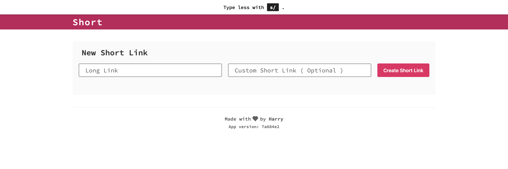
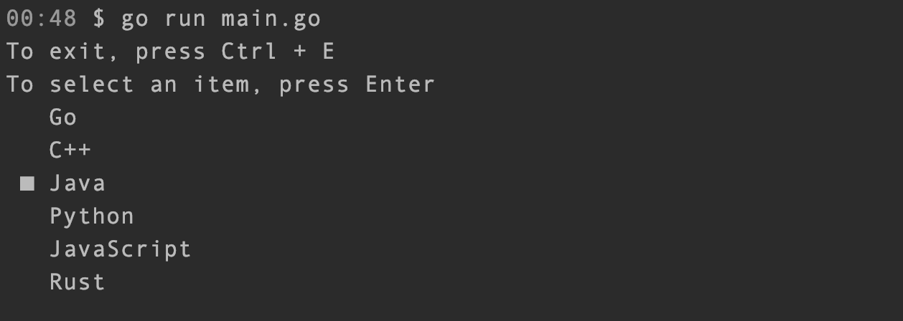

# app
Reusable framework for Go apps & command line tools

## Features

`app` abstracts out each component of the framework, allowing you to swap out any part at any time you want without changing the rest of your application.

Currently `app` provides the following components:

- HTTP router
- GraphQL
- GRPC
- Database
  - Driver
  - Schema & data migration
- Environmental variables
  - Easy retrieving
  - Automatically load `.env` file when presents
- JWT
  - encoding
  - decoding
- TLS
- Timer
- Logger
- Tracer
- Terminal GUI

`app` also includes convenient helpers to facilitate automated testing.

### To be supported

- Service registry
- Message queue
- Redis Driver

## Projects using `app`

- [Short](https://github.com/byliuyang/short): URL shortening service
  
  

- [Kgs](https://github.com/byliuyang/kgs): Distributed Key Generation Service


### CLI


## Building your own application

### Managing dependencies

Dependency injection is recommended to make your app easy to change and testable. [wire](https://github.com/google/wire) is a compile time dependency injection framework for Go apps. Here is the example usage:

```go
//+build wireinject
var authSet = wire.NewSet(
	provider.JwtGo,

	wire.Value(provider.TokenValidDuration(oneDay)),
	provider.Authenticator,
)

var observabilitySet = wire.NewSet(
	mdlogger.NewLocal,
	mdtracer.NewLocal,
)

func InjectGraphQlService(
	name string,
	sqlDB *sql.DB,
	graphqlPath provider.GraphQlPath,
	secret provider.ReCaptchaSecret,
	jwtSecret provider.JwtSecret,
) mdservice.Service {
	wire.Build(
		wire.Bind(new(fw.GraphQlAPI), new(graphql.Short)),
		wire.Bind(new(url.Retriever), new(url.RetrieverPersist)),
		wire.Bind(new(url.Creator), new(url.CreatorPersist)),
		wire.Bind(new(repo.UserURLRelation), new(db.UserURLRelationSQL)),
		wire.Bind(new(repo.URL), new(*db.URLSql)),

		observabilitySet,
		authSet,

		mdservice.New,
		provider.GraphGophers,
		mdhttp.NewClient,
		mdrequest.NewHTTP,
		mdtimer.NewTimer,

		db.NewURLSql,
		db.NewUserURLRelationSQL,
		keygen.NewInMemory,
		url.NewRetrieverPersist,
		url.NewCreatorPersist,
		provider.ReCaptchaService,
		requester.NewVerifier,
		graphql.NewShort,
	)
	return mdservice.Service{}
}
```

The following code will be generated after running `wire` command:

```go
func InjectGraphQlService(name string, sqlDB *sql.DB, graphqlPath provider.GraphQlPath, secret provider.ReCaptchaSecret, jwtSecret provider.JwtSecret) mdservice.Service {
	logger := mdlogger.NewLocal()
	tracer := mdtracer.NewLocal()
	urlSql := db.NewURLSql(sqlDB)
	retrieverPersist := url.NewRetrieverPersist(urlSql)
	userURLRelationSQL := db.NewUserURLRelationSQL(sqlDB)
	keyGenerator := keygen.NewInMemory()
	creatorPersist := url.NewCreatorPersist(urlSql, userURLRelationSQL, keyGenerator)
	client := mdhttp.NewClient()
	httpRequest := mdrequest.NewHTTP(client)
	reCaptcha := provider.ReCaptchaService(httpRequest, secret)
	verifier := requester.NewVerifier(reCaptcha)
	cryptoTokenizer := provider.JwtGo(jwtSecret)
	timer := mdtimer.NewTimer()
	tokenValidDuration := _wireTokenValidDurationValue
	authenticator := provider.Authenticator(cryptoTokenizer, timer, tokenValidDuration)
	short := graphql.NewShort(logger, tracer, retrieverPersist, creatorPersist, verifier, authenticator)
	server := provider.GraphGophers(graphqlPath, logger, tracer, short)
	service := mdservice.New(name, server, logger)
	return service
}
```

### Adding GraphQL API

```go
package graphql

import (
	"short/app/adapter/graphql/resolver"
	"short/app/usecase/auth"
	"short/app/usecase/requester"
	"short/app/usecase/url"

	"github.com/byliuyang/app/fw"
)

var _ fw.GraphQlAPI = (*Short)(nil)

type Short struct {
	resolver *resolver.Resolver
}

func (t Short) GetSchema() string {
	return schema
}

func (t Short) GetResolver() interface{} {
	return t.resolver
}

func NewShort(
	logger fw.Logger,
	tracer fw.Tracer,
	urlRetriever url.Retriever,
	urlCreator url.Creator,
	requesterVerifier requester.Verifier,
	authenticator auth.Authenticator,
) Short {
	r := resolver.NewResolver(
		logger,
		tracer,
		urlRetriever,
		urlCreator,
		requesterVerifier,
		authenticator,
	)
	return Short{
		resolver: &r,
	}
}

```

### Adding HTTP APIs

```go
func NewShort(
	logger fw.Logger,
	tracer fw.Tracer,
	webFrontendURL string,
	timer fw.Timer,
	urlRetriever url.Retriever,
	githubOAuth oauth.Github,
	githubAPI github.API,
	authenticator auth.Authenticator,
	accountService service.Account,
) []fw.Route {
	githubSignIn := signin.NewOAuth(githubOAuth, githubAPI, accountService, authenticator)
	frontendURL, err := netURL.Parse(webFrontendURL)
	if err != nil {
		panic(err)
	}
	return []fw.Route{
		{
			Method: "GET",
			Path:   "/oauth/github/sign-in",
			Handle: NewGithubSignIn(logger, tracer, githubOAuth, authenticator, webFrontendURL),
		},
		{
			Method: "GET",
			Path:   "/oauth/github/sign-in/callback",
			Handle: NewGithubSignInCallback(logger, tracer, githubSignIn, *frontendURL),
		},
		{
			Method: "GET",
			Path:   "/r/:alias",
			Handle: NewOriginalURL(logger, tracer, urlRetriever, timer, *frontendURL),
		},
	}
}
```

### Creating GRPC APIs

```go
var _ fw.GRpcAPI = (*KgsAPI)(nil)

type KgsAPI struct {
	keyGenServer KeyGenServer
}

func (k KgsAPI) RegisterServers(server *grpc.Server) {
	RegisterKeyGenServer(server, k.keyGenServer)
}

func NewKgsAPI(keyGenServer KeyGenServer) KgsAPI {
	return KgsAPI{keyGenServer: keyGenServer}
}
```

### Accesing enviromental variables

```go
env := dep.InitEnvironment()
env.AutoLoadDotEnvFile()

host := env.GetEnv("DB_HOST", "localhost")
```

### Accessing database

#### Establish connection

```go
db, err := dbConnector.Connect(dbConfig)
	if err != nil {
		panic(err)
	}
```

#### Migrate schema & data

```go
err = dbMigrationTool.Migrate(db, migrationRoot)
if err != nil {
	panic(err)
}
```

```sql
-- create_table.sql

-- +migrate Up
CREATE TABLE available_key (
    key VARCHAR(10),
    created_at TIMESTAMP WITH TIME ZONE
);

-- +migrate Down
DROP TABLE available_key;
```

```-- +migrate Up``` and ```-- +migrate Down``` comments are required.

### Builing command line tools

#### Without GUI

```go
// main.go
rootCmd := cmd.NewRootCmd(
		dbConfig,
		dbConnector,
		dbMigrationTool,
		securityPolicy,
		gRpcAPIPort,
	)
cmd.Execute(rootCmd)
```

```go
// cmd/cmd.go

// NewRootCmd creates and initializes root command
func NewRootCmd(
	dbConfig fw.DBConfig,
	dbConnector fw.DBConnector,
	dbMigrationTool fw.DBMigrationTool,
	securityPolicy fw.SecurityPolicy,
	gRpcAPIPort int,
) fw.Command {
	var migrationRoot string

	cmdFactory := dep.InitCommandFactory()
	startCmd := cmdFactory.NewCommand(
		fw.CommandConfig{
			Usage: "start",
			OnExecute: func(cmd *fw.Command, args []string) {
				app.Start(
					dbConfig,
					migrationRoot,
					dbConnector,
					dbMigrationTool,
					securityPolicy,
					gRpcAPIPort,
				)
			},
		},
	)
	startCmd.AddStringFlag(&migrationRoot, "migration", "app/adapter/migration", "migration migrations root directory")

	rootCmd := cmdFactory.NewCommand(
		fw.CommandConfig{
			Usage:     "kgs",
			OnExecute: func(cmd *fw.Command, args []string) {},
		},
	)
	err := rootCmd.AddSubCommand(startCmd)
	if err != nil {
		panic(err)
	}
	return rootCmd
}

// Execute runs root command
func Execute(rootCmd fw.Command) {
	err := rootCmd.Execute()
	if err != nil {
		fmt.Println(err)
		os.Exit(1)
	}
}
```

#### With GUI

```go
// main.go
func main() {
	sampleTool := tool.NewSampleTool()
	sampleTool.Execute()
}
```

```go
// tool/sample.go

type SampleTool struct {
	term            terminal.Terminal
	exitChannel     eventbus.DataChannel
	keyUpChannel    eventbus.DataChannel
	keyDownChannel  eventbus.DataChannel
	keyEnterChannel eventbus.DataChannel
	cli             cli.CommandLineTool
	rootCmd         *cobra.Command
	radio           ui.Radio
	languages       []string
}

func (s SampleTool) Execute() {
	if err := s.rootCmd.Execute(); err != nil {
		fmt.Println(err)
		os.Exit(1)
	}
}

func (s SampleTool) bindKeys() {
	s.term.OnKeyPress(terminal.CtrlEName, s.exitChannel)
	s.term.OnKeyPress(terminal.CursorUpName, s.keyUpChannel)
	s.term.OnKeyPress(terminal.CursorDownName, s.keyDownChannel)
	s.term.OnKeyPress(terminal.EnterName, s.keyEnterChannel)
	fmt.Println("To exit, press Ctrl + E")
	fmt.Println("To select an item, press Enter")
}

func (s SampleTool) handleEvents() {
	s.cli.EnterMainLoop(func() {
		select {
		case <-s.exitChannel:
			s.radio.Remove()
			fmt.Println("Terminating process...")
			s.cli.Exit()
		case <-s.keyUpChannel:
			s.radio.Prev()
		case <-s.keyDownChannel:
			s.radio.Next()
		case <-s.keyEnterChannel:
			s.radio.Remove()
			selectedItem := s.languages[s.radio.SelectedIdx()]
			fmt.Printf("Selected %s\n", selectedItem)
			s.cli.Exit()
		}
	})
}

func NewSampleTool() SampleTool {
	term := terminal.NewTerminal()
	languages := []string{
		"Go",
		"Rust",
		"C",
		"C++",
		"Java",
		"Python",
		"C#",
		"JavaScript",
		"TypeScript",
		"Swift",
		"Kotlin",
	}

	sampleTool := SampleTool{
		term:            term,
		cli:             cli.NewCommandLineTool(term),
		exitChannel:     make(eventbus.DataChannel),
		keyUpChannel:    make(eventbus.DataChannel),
		keyDownChannel:  make(eventbus.DataChannel),
		keyEnterChannel: make(eventbus.DataChannel),
		radio:           ui.NewRadio(languages, 3, term),
		languages:       languages,
	}
	rootCmd := &cobra.Command{
		Run: func(cmd *cobra.Command, args []string) {
			sampleTool.bindKeys()
			sampleTool.radio.Render()
			sampleTool.handleEvents()
		},
	}
	sampleTool.rootCmd = rootCmd
	return sampleTool
}
```

## Contributing

When contributing to this repository, please first discuss the change you wish
to make via [Slack channel](https://short-d.com/r/slack) with the owner
of this repository before making a change.

Please open a draft pull request when you are working on an issue so that the
owner knows it is in progress. The owner may take over or reassign the issue if no
body replies after ten days assigned to you.

### Pull Request Process

1. Update the README.md with details of changes to the interface, this includes
   new environment variables, exposed ports, useful file locations and container
   parameters.
1. You may merge the Pull Request in once you have the sign-off of code owner,
   or if you do not have permission to do that, you may request the code owner
   to merge it for you.

### Code of Conduct

- Using welcoming and inclusive language
- Being respectful of differing viewpoints and experiences
- Gracefully accepting constructive criticism
- Focusing on what is best for the community
- Showing empathy towards other community members

### Discussions

Please join this [Slack channel](https://short-d.com/r/slack) to
discuss bugs, dev environment setup, tooling, and coding best practices.

## Author
Harry Liu - [byliuyang](https://github.com/byliuyang)

## License
This project is maintained under MIT license
