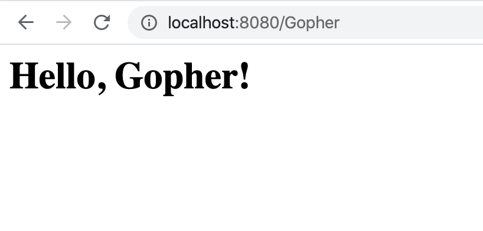

# app
Reusable framework for Go apps & command line tools

## Features

- HTTP router
- GraphQL
- GRPC
- Database migration
- Environmental variables
- JWT
- Email API
- Timer
- Logger
- Terminal GUI

## Build your first scalable web service

1. Create `routing.go` with the following content:

    ```go
    package main
    
    import (
    	"fmt"
    	"net/http"
    
    	"github.com/short-d/app/fw/router"
    	"github.com/short-d/app/fw/service"
    )
    
    func main() {
    	routes := []router.Route{
    		{
    			Method:      http.MethodGet,
    			MatchPrefix: false,
    			Path:        "/:name",
    			Handle: func(w http.ResponseWriter, r *http.Request, params router.Params) {
    				name := params["name"]
    				page := fmt.Sprintf(`<h1>Hello, %s!<h1>`, name)
    				w.Write([]byte(page))
    			},
    		},
    	}
    
    	routingService := service.
    		NewRoutingBuilder("Example").
    		Routes(routes).
    		Build()
	
    	routingService.StartAndWait(8080)
    }
    ```

2. Start the service using this command:

    ```bash
    go run routing.go
    ```

3. That's it! You can now visit the web page at [http://localhost:8080/Gopher](http://localhost:8080/Gopher)!



## Projects using `app`

- [Short](https://short-d.com/r/code): Easy to use URL shortening service
- [Kgs](https://short-d.com/r/kgs): Distributed unique key generation service

## Contributing

When contributing to this repository, please first discuss the change you wish
to make via [Slack channel](https://short-d.com/r/slack) with the owner
of this repository before making a change.

Please open a draft pull request when you are working on an issue so that the
owner knows it is in progress. The owner may take over or reassign the issue if no
body replies after ten days assigned to you.

### Pull Request Process

1. Update the README.md with details of changes to the interface, this includes
   new environment variables, exposed ports, useful file locations and container
   parameters.
1. You may merge the Pull Request in once you have the sign-off of code owner,
   or if you do not have permission to do that, you may request the code owner
   to merge it for you.

### Code of Conduct

- Using welcoming and inclusive language
- Being respectful of differing viewpoints and experiences
- Gracefully accepting constructive criticism
- Focusing on what is best for the community
- Showing empathy towards other community members

### Discussions

Please join this [Slack channel](https://short-d.com/r/slack) to
discuss bugs, dev environment setup, tooling, and coding best practices.

## Author
Harry Liu - [byliuyang](https://github.com/byliuyang)

## License
This project is maintained under MIT license.
